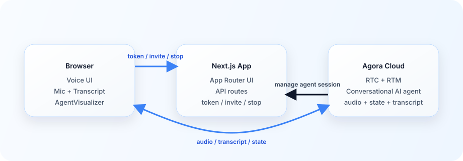

# InterviewIQ — Adaptive Voice Interview Console

[](https://github.com/AgoraIO-Conversational-AI/agent-quickstart-nextjs/actions/workflows/build-check.yml)
[](./LICENSE)
[](https://nodejs.org/)

InterviewIQ is a professional, evidence-first interview console built on the Agora Conversational AI Next.js quickstart. It combines a real-time voice agent, live transcript, pipeline latency, skill evidence, reliability gates, next-question reasoning, and a recruiter-facing scorecard in one responsive workspace.

The current interview-intelligence panels use the repository's demo dataset as a presentation adapter. The Agora RTC/RTM session, transcript, metrics, connection diagnostics, and voice controls remain live; the separate intelligence layer can replace the demo adapter without changing the presentation architecture.

## Prerequisites

- [Node.js 22+](https://nodejs.org/en/download/)
- [pnpm](https://pnpm.io/installation)
- [Agora CLI](https://github.com/AgoraIO-Community/cli)

## Run It

Getting started is quick and easy: install the CLI _(skip if you already have it)_ , scaffold the Next.js quickstart using the Agora CLI, install dependencies, and run.

1. **Install the Agora CLI and sign in**
   _(skip if `agora` is already on your PATH)_:

   macOS and Linux:

   ```bash
   curl -fsSL https://raw.githubusercontent.com/AgoraIO/cli/main/install.sh | sh -s -- --add-to-path
   ```

   Windows PowerShell:

   ```powershell
   irm https://dl.agora.io/cli/install.ps1 | iex
   ```

   If the Windows install command fails in PowerShell, try running the macOS/Linux command from [Git Bash](https://git-scm.com/downloads/win), then open a new terminal and run `agora --help` to confirm the CLI is on your PATH.

   Then verify and sign in:

   ```bash
   agora --help
   agora login
   ```

   If `agora --help` is not found after install, close and reopen your terminal, then try again. If it still fails, check that the installer-added Agora CLI location is on your shell `PATH`.

2. **Scaffold and run**
   `agora init` clones the starter, binds an Agora project, and writes `.env.local`. (replace `my-nextjs-demo` with your own project name):

   ```bash
   agora init my-nextjs-demo --template nextjs
   cd my-nextjs-demo
   pnpm install
   pnpm dev
   ```

3. Open [http://localhost:3000](http://localhost:3000) and click **Start conversation**.

If the agent does not join or transcripts do not appear, run **`agora project doctor --deep`** to check credentials, feature enablement, network reachability, and local env binding.

### Working from a clone of this repository

Use this path if you already cloned **this** repo (for example to contribute or fork):

```bash
git clone https://github.com/AgoraIO-Conversational-AI/agent-quickstart-nextjs.git
cd agent-quickstart-nextjs
agora login
agora project use <your-project>
pnpm install
agora project env write .env.local
agora project doctor --deep
pnpm dev
```

### Deploy to Vercel

[](https://vercel.com/new/clone?repository-url=https%3A%2F%2Fgithub.com%2FAgoraIO-Conversational-AI%2Fagent-quickstart-nextjs&project-name=agent-quickstart-nextjs&repository-name=agent-quickstart-nextjs&env=NEXT_PUBLIC_AGORA_APP_ID,NEXT_AGORA_APP_CERTIFICATE&envDescription=Agora%20credentials%20needed%20to%20run%20the%20app&envLink=https%3A%2F%2Fgithub.com%2FAgoraIO-Conversational-AI%2Fagent-quickstart-nextjs%23run-it&demo-title=Agora%20Conversational%20AI%20Next.js%20Quickstart&demo-description=Official%20Next.js%20quickstart%20for%20building%20browser-based%20voice%20AI%20with%20Agora&demo-image=https%3A%2F%2Fraw.githubusercontent.com%2FAgoraIO-Conversational-AI%2Fagent-quickstart-nextjs%2Fmain%2F.github%2Fassets%2FConversation-Ai-Client.gif)

To populate Vercel env vars from your bound Agora project:

```bash
agora project use <your-project>
agora project env write .env.local
rg "^(NEXT_PUBLIC_AGORA_APP_ID|NEXT_AGORA_APP_CERTIFICATE)=" .env.local
```

Copy those two values into Vercel Project Settings -> Environment Variables.

### Environment variables

Defined in [`env.local.example`](env.local.example).

| Variable                     | Required | Notes                                                            |
| ---------------------------- | :------: | ---------------------------------------------------------------- |
| `NEXT_PUBLIC_AGORA_APP_ID`   |    ✅    | Agora Console → Project → App ID.                                |
| `NEXT_AGORA_APP_CERTIFICATE` |    ✅    | Agora Console → Project → App Certificate. **Server-side only.** |

The default agent configuration in [`app/api/invite-agent/route.ts`](app/api/invite-agent/route.ts) uses Agora-managed STT, LLM, and TTS, so no extra vendor API keys are required for the base quickstart.

## Commands

```bash
# Dev
pnpm dev                # start the Next.js dev server

# Quality & Tests
pnpm run lint           # eslint
pnpm run typecheck      # tsc --noEmit
pnpm test               # run interview intelligence unit test suite
pnpm run doctor         # local prereqs + env binding

# CI / pre-ship
pnpm run verify:api     # API contract checks
pnpm run build          # production build
pnpm run verify         # doctor + lint + typecheck + test + verify:api + build
```

Run `pnpm run verify` before shipping changes — it covers local prerequisites, lint, type safety, unit tests for evidence extraction and gate checks, the core API route contracts, and the production build.

## Architecture

<picture>
  <source media="(prefers-color-scheme: dark)" srcset="./system-architecture-dark.svg">
  
</picture>

1. **Agora Cloud Real-Time Voice Pipeline**: The browser fetches a combined RTC + RTM token (`buildTokenWithRtm`) from this app, joins the channel using a single RTC client, and receives transcripts, agent state, metrics, and error events over RTM. The Conversational AI Engine runs STT (Deepgram Nova-3) → LLM (GPT-4o-mini with the InterviewIQ technical interviewer prompt) → TTS (MiniMax) in Agora Cloud.
2. **InterviewIQ Deterministic Intelligence Layer**:
   - **Evidence Extraction**: Automatically analyzes finalized candidate transcript turns across 5 competencies (`React`, `Performance`, `JavaScript`, `Problem Solving`, `Communication`).
   - **Anti-Hallucination Guard**: Rejects any candidate quote that is not an exact verbatim substring of the finalized transcript.
   - **Monotonic Progression**: Once a candidate demonstrates proven competency, evidence cannot be downgraded by subsequent answers.
   - **Next-Best-Question (NBQ) Selector**: Target-skill prioritization based on largest evidence gaps within a 3-turn budget.
   - **Reliability Gate Sentinel**: Tests every candidate question against 5 checks (Format, Relevance, Repetition, Latency ≤1500ms, Quality). If any check fails, safely delivers a vetted fallback from the question bank.
   - **Live Scorecard Generation**: Auditable hiring recommendations (`Advance`, `Targeted follow-up required`, `Insufficient evidence`) frozen upon call completion.

## What You Get

- an InterviewIQ briefing screen with role, candidate, résumé, skill targets, and showcase-only GitHub/CV source controls
- a responsive live interview console with clear listening, thinking, speaking, and connection states
- structured transcript, STT/LLM/TTS pipeline instrumentation, and microphone controls
- a signature Evidence Stack, next-best-question decision rail, and visible reliability gates
- a post-interview evidence scorecard and auditable question trace
- browser RTC audio plus RTM transcript, agent state, metrics, and error events
- server routes for token generation, agent invite, and session stop

## How It Works

1. The browser requests an RTC + RTM token from `/api/generate-agora-token`.
2. The backend invites an Agora cloud agent with `/api/invite-agent`.
3. The browser joins the channel and publishes mic audio.
4. The client receives transcript, agent state, and `AGENT_METRICS` (per-stage latency) events over RTM.
5. On end, the client calls `/api/stop-conversation`, logs out RTM, and unmounts the call view so Agora React hooks clean up RTC publish/join and the local microphone track.

## Optional BYOK

The base `.env.local` contract contains only Agora credentials. If you are migrating from a supported provider, uncomment the matching snippet in [`app/api/invite-agent/route.ts`](app/api/invite-agent/route.ts) and add its variables to your local environment.

```bash
# Deepgram STT
NEXT_DEEPGRAM_API_KEY=...

# OpenAI-compatible LLM
NEXT_LLM_URL=https://api.openai.com/v1/chat/completions
NEXT_LLM_API_KEY=...

# ElevenLabs TTS
NEXT_ELEVENLABS_API_KEY=...
NEXT_ELEVENLABS_VOICE_ID=...
```

## Repo Map

- `app/api/generate-agora-token/route.ts` — issues RTC + RTM tokens
- `app/api/invite-agent/route.ts` — starts the agent session and configures the pipeline
- `app/api/stop-conversation/route.ts` — stops the agent session
- `components/LandingPage.tsx` — entry point: token fetch, RTM login, conversation lifecycle
- `components/ConversationComponent.tsx` — RTC client, transcript state, `AGENT_METRICS`, mic release
- `components/QuickstartConversationLayout.tsx` — in-call header, transcript rail, controls dock
- `components/QuickstartPipelineMetrics.tsx` — per-stage latency chips in the header
- `components/QuickstartTranscriptPanel.tsx` — live transcript rail
- `components/QuickstartPreCallCard.tsx` — pre-call hero card
- `components/EvidenceMap.tsx` — signature skill-evidence stack
- `components/DecisionRail.tsx` — next-question and reliability-gate flow
- `components/Scorecard.tsx` — post-interview evidence review
- `lib/conversation.ts` — transcript normalization and visualizer state mapping
- `AGENTS.md` — primary agent-facing guide

## Troubleshooting

- **Agent does not join or transcripts are missing:** run `agora project doctor --deep`.
- **`pnpm run doctor` fails:** run `agora project env write .env.local`, then retry.
- **Manual clone / env values:** `agora project use <your-project>` then `agora project env write .env.local`.
- **RTM login fails:** keep [`app/api/generate-agora-token/route.ts`](app/api/generate-agora-token/route.ts) on `RtcTokenBuilder.buildTokenWithRtm` — RTC-only tokens will not satisfy `rtm.login`.
- **Transcript speakers inverted:** check the `uid === "0"` remap in [`components/ConversationComponent.tsx`](components/ConversationComponent.tsx).
- **Agent never appears in channel:** ensure the shared agent UID in [`lib/agora.ts`](lib/agora.ts) is used by both the client and invite route.

## More Docs

- [docs/ai/L0_repo_card.md](./docs/ai/L0_repo_card.md)
- [docs/ai/RECIPE.md](./docs/ai/RECIPE.md)
- [AGENTS.md](./AGENTS.md)

## Contributing

Pull requests welcome — see [CONTRIBUTING.md](./CONTRIBUTING.md) for development setup and conventions.

## Security

Please do **not** open public issues for security reports. Email security@agora.io with details and reproduction steps.

## License

Released under the [MIT License](./LICENSE).
